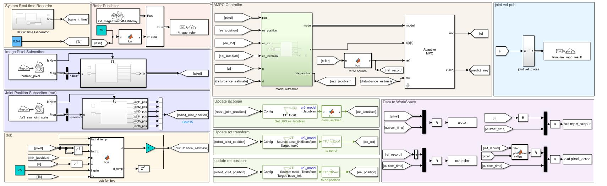

<h1 align="center">
  UR3 Unity ROS2 IBVS
</h1>
<p align="center">
<p align="center">
  UR3 Image-based Visual Servoing Simulation Experiment - Unity Simulation Environment
</p>
<p align="center">
English | <a href="README_zh_CN.md">简体中文</a>
</p>

## Environment Required for Simulation Source Code Compilation
The environment used for simulation is Unity 2021.3.22f1

```sh
git clone https://github.com/zhutianqi2006/ur3_unity_ros2_ibvs.git
```
❗❗❗Before opening the project, make sure Blender is installed on your computer, and it is set as the default program to open .blend files.

Then, open the ur3_unity_ros2_ibvs project.


## Unity Projects Referenced in the Simulation
| Project | Link|
| --------------------------| ------------------------------------------------------------------------------------- |
| Unity3D_Robotics_UR| https://github.com/rparak/Unity3D_Robotics_UR  |
| ros2-for-unity | https://github.com/RobotecAI/ros2-for-unity|

The ros2-for-unity project uses Humble Standalone and does not depend on additional ros2 environments.

## Simulation Project Description

<p align="center">

</p>

### Buttons in the Control Panel:

⭐1: Jogging the robot arm, available when disconnected from ros2.

⭐2: ros2 connection button, when clicked, it displays connect and disconnect buttons. Clicking the connect button allows receiving messages from ros2, and vice versa, disconnects the connection.

⭐3: End-effector camera view button, when clicked, the bottom-left corner shows the end-effector camera view with a resolution of 640*480.

### Buttons in the Reset Panel:

Clicking any of these buttons will disconnect from ros2 and reset the positions of the robot arm and objects.

🌟 Rest1: Displacement Test 🌟 Rest2: Large Rotation Test

🌟 Rest3: Small Rotation with Displacement 🌟 Rest4: Large Rotation with Displacement

### Buttons in the Camera View Panel:

💫 Adjust the viewing angle in Unity

### Keyboard Controls:

Object tracking control
```
Up/Down - Move object forward/backward
Left/Right - Move object left/right
Q/E - Rotate around a vertical axis with respect to the ground
```

### ros2 Communication:

Unity publishes two topics, where /current_pixel publishes the pixel position with data type std_msgs/Float64MultiArray, and /ur3_sim_joint_state publishes joint information, currently only carrying joint positions with data type sensor_msgs/JointState.

The subscribed topic is /simulink_mpc_result, used to obtain joint velocities with data type std_msgs/Float64MultiArray.

### MPC Controller:

This project does not involve the controller part. Controller examples can be found in the Simulink project:

| Project | Link|
| --------------------------| ------------------------------------------------------------------------------------- |
| UR3 Simulink ROS2 IBVS | https://github.com/rparak/Unity3D_Robotics_URdownload/  |