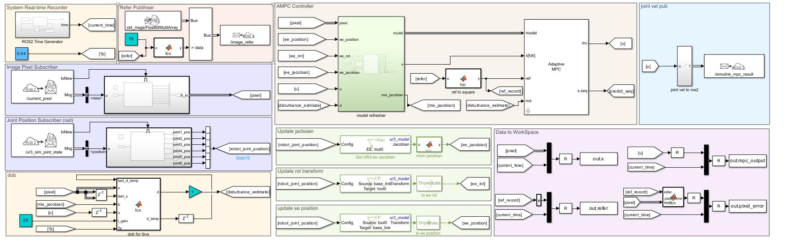

<h1 align="center">
  UR3 Unity ROS2 IBVS
</h1>
<p align="center">
<p align="center">
  UR3图像视觉伺服仿真实验-Unity仿真环境
</p>
<p align="center">
<a href="README.md">English</a> | 简体中文
</p>

## 仿真源码编译所需环境
仿真所用环境为Unity 2021.3.22f1

```sh
git clone https://github.com/zhutianqi2006/ur3_unity_ros2_ibvs.git
```
❗❗❗在打开项目前请务必确保电脑中已安装blender，并且为.blend文件的默认打开方式。

然后再打开 `ur3_unity_ros2_ibvs`项目。

## 仿真所引用unity项目
| Project | Link|
| --------------------------| ------------------------------------------------------------------------------------- |
| Unity3D_Robotics_UR| https://github.com/rparak/Unity3D_Robotics_UR  |
| ros2-for-unity | https://github.com/RobotecAI/ros2-for-unity|

其中ros2-for-unity所用为humble standalone，不依赖额外的ros2环境

## 仿真项目描述

<p align="center">

</p>

### Control Panel 中的按键：

⭐1：机械臂点动按钮，可在断开ros2连接使用。

⭐2：ros2链接按钮，点开后存在connect按钮和disconnect按钮，点击connect的按钮可以接受来自ros2的消息，反之则断开连接。

⭐3：末端相机查看按钮，点开后左下角会出现末端相机视角，其分辨率为640*480。
### Reset Panel 中的按键：

无论按到那个都会断开与ros2的连接，并且重置机械臂和物体的位置

🌟 Rest1：位移测试 🌟 Rest2：大幅度旋转测试

🌟 Rest3：小幅度旋转加位移 🌟 Rest4：大幅度旋转加位移 

### Reset Panel 中的按键：

💫 调整unity中的观察视角

### 键盘按钮：

跟踪物体控制
```
Up/Down - 物体前进后退
Left/Right - 物体左右移动
Q/E - 以垂直地面方向为轴旋转
```

### ros2通讯：

unity中会发布两个话题，其中/current_pixel发布像素点位置，数据类型为std_msgs/Float64MultiArray；其中/ur3_sim_joint_state为关节信息，目前仅装载关节位置，数据类型为sensor_msgs/JointState。

订阅话题为/simulink_mpc_result, 用于获取关节速度，数据类型为std_msgs/Float64MultiArray。

### mpc控制器：

本项目不涉及控制器部分，控制器示例可见simulnik中项目

| Project | Link|
| --------------------------| ------------------------------------------------------------------------------------- |
| UR3 Simulink ROS2 IBVS | https://github.com/rparak/Unity3D_Robotics_URdownload/  |