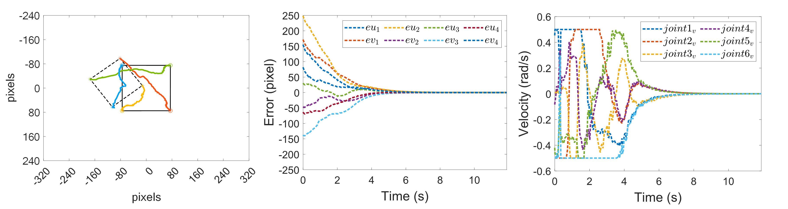

<h1 align="center">
  UR3 Unity ROS2 IBVS
</h1>
<p align="center">
<p align="center">
  UR3图像视觉伺服仿真实验-simulink mpc控制器
</p>
<p align="center">
<a href="README.md">English</a> | 简体中文
</p>

## 仿真所需环境
仿真所用环境要保证matlab 版本大于2023a
除了基础的simulink组件要保证安装matlab官方的ROS Toolbox和 Model Predictive Control Toolbox。
| matlab toolbox | Link|
| --------------------------| ------------------------------------------------------------------------------------- |
| ROS Toolbox| https://www.mathworks.com/products/ros.html  |
| Model Predictive Control Toolbox | https://www.mathworks.com/products/model-predictive-control.html|

clone代码到本地
```sh
git clone https://github.com/zhutianqi2006/ur3_unity_ros2_ibvs.git
```


## 控制器使用描述

<p align="center">

</p>

### 控制器运行：

⭐1：运行simulink前，先运行all_init.m，初始化mpc控制器和ur3模型，并将其保留在工作空间。

⭐2：在保证机械臂和视觉可以通信时，运行ur3_simulink_ros2_ibvs_mpc.slx执行mpc控制器，发布期望的关节速度。

⭐3：停止simulink文件，运行过程中的数据会保存在工作空间，打开plot文件夹，选择对应的m文件进行画图。
<p align="center">

</p>

### UR3 IBVS仿真器：

控制器部分不包括机械臂仿真模型，对应的仿真器可以在下面项目的release中直接下载。

| Project | Link|
| --------------------------| ------------------------------------------------------------------------------------- |
| UR3 Unity ROS2 IBVS | https://github.com/zhutianqi2006/ur3_unity_ros2_ibvs  |

### 常见问题

如果simulink编译后无法运行，删除C:\ProgramData\eprosima\fastrtps_interprocess内的所有文件即可。